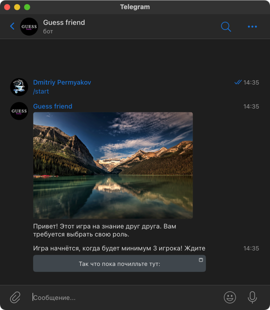

# GroupGame
 
[![\[Telegram\] aiogram live](https://img.shields.io/badge/telegram-aiogram-blue.svg?style=flat-square&logo=telegram)](https://t.me/aiogram_live)

- [code implementation(https://github.com/IU5-BOT/GroupGame/blob/main/handlers/operations.py)

